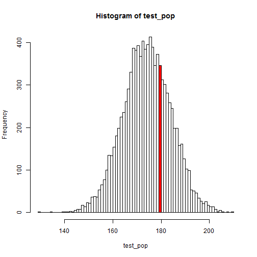

## DNORM - Density Normal Distribution

**dnorm is useful for calculating density at a given point of a normal distribution.** In other terms, dnorm indicates which part a specific value makes up in the distribution.

**Example**:
We would like to know how many people are 180cm tall among a normally-distributed population (with a mean centered around 174 and a standard deviation of 10).

**dnorm's variables**:

* x = a value among others in the distribution / the quantile

* mean = mean of the normal distribution

* sd = standard deviation of the normal distribution


```r
#Generate our test distribution
test_pop <- rnorm(n=10000,mean=174,sd=10)

#A nicely colored plot to illustrate what dnorm is doing
h <- hist(test_pop, breaks=100, plot = FALSE)
bin <- cut(180, h$breaks)
clr <- rep("white", length(h$counts))
clr[bin] <- "red"
plot(h, col=clr)
```



```r
dex <- dnorm(x=180,mean=mean(test_pop),sd=sd(test_pop))
print(dex)
```

```
## [1] 0.03339712
```

**What goes in, what comes out**:

* **Input**: 180cm (quantile / the x-value of where the red bar stands)

* **Output**: Density at that given point (y-value = height of the red bar)

The output is 0.0333971, which tells us the 3.34% of the distribution (people) is located at exactly 180 (cm).

This is of course a somewhat artificial number as there is not a single observation at exactly 180 in our test distribution. You can see that by going through the numbers yourself.


```r
#Show a part of the observations to confirm that we are dealing with continuous data
head(unique(test_pop))
```

```
## [1] 178.3261 202.2851 164.2454 181.1110 166.2863 164.2145
```

We are clearly dealing with continous (vs discrete) numerical data. This does not stop us from using dnorm with a rounded value such as 180.

*Please note that the y-value over the total area would provide the probability*
