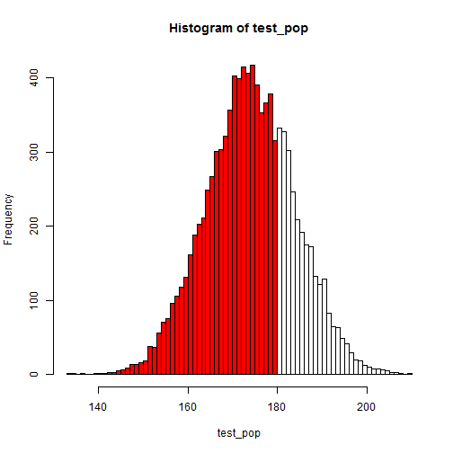

##PNORM - Probability Normal Distribution
 
**pnorm is useful for calculating the probability of a value in part of a normal distribution.** In other terms, how likely is a variable to be in a given range of values.

**Example**:
For instance, we would like to know the probability of being 180cm tall or smaller among a normally-distributed population (with mean at 174 and sd of 10).

**pnorm's variables**:

* x = a value among others in the distribution / the quantile

* mean = mean of the normal distribution

* sd = standard deviation of the normal distribution

* lower.tail = TRUE if you want the probability for values equal or smaller than x; =FALSE if you want the probability for values bigger than x


```r
# Generate our test distribution
test_pop <- rnorm(n=10000,mean=174,sd=10)

# A nicely colored plot to illustrate for which part pnorm is calculating the probability
h <- hist(test_pop, breaks=100, plot = FALSE)
blw <- h$breaks[which(h$breaks<=180)]
bin <- cut(blw, h$breaks)
clr <- rep("white", length(h$counts))
clr[bin] <- "red"
plot(h, col=clr)
```



```r
# Now let us calculate the probability mass of values => 180 in our test population
pex <- pnorm(q=180,mean=mean(test_pop),sd=sd(test_pop),lower.tail = TRUE)
print(pex)
```

```
## [1] 0.726147
```

**What goes in, what comes out**:

* **Input**: 180cm (*x*), information about the distribution (*mean and sd*) and indication which part of the distribution (*lower.tail*)

* **Output**: The probabiliy of being 180cm tall or smaller among the given distribution is 0.73% (=probability of a variable to be in the chosen part of the distribution)
